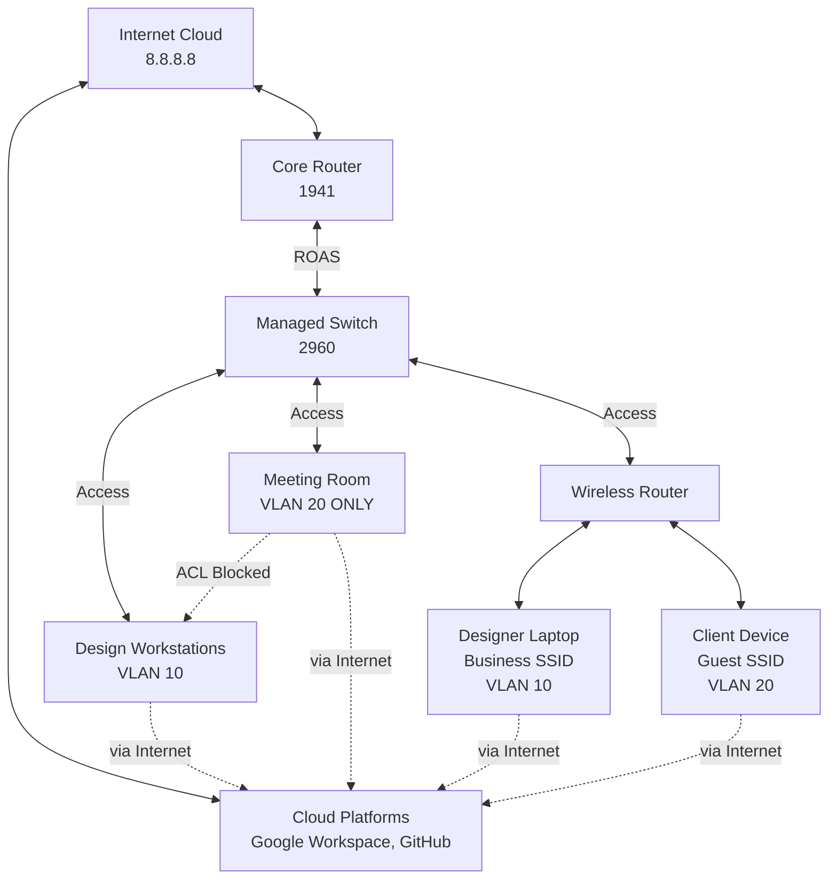

# **Project 01: SOHO Network - Secure Small Office Implementation**

**Status:** Tested ✅ | **Last Updated:** 2024-01-20

## **Table of Contents**
- [Objective](#objective)
- [Business Context](#business-context)
- [Quick Start](#quick-start)
- [Topology & Design](#topology--design)
- [Configuration](#configuration)
- [Verification](#verification)
- [Troubleshooting](#troubleshooting)
- [Protocol Deep Dive](#protocol-deep-dive)
- [Skills Demonstrated](#skills-demonstrated)
- [Real-World Applications](#real-world-applications)
- [Learning Outcomes](#learning-outcomes)

## **Objective**
> Implement a secure, segmented network for a growing web design studio that separates business operations from client access while protecting cloud-based assets.

**Key Goals:**
- [ ] Create VLAN segmentation for business and guest traffic
- [ ] Configure router-on-a-stick for inter-VLAN routing
- [ ] Implement basic port security on switch ports
- [ ] Set up multi-SSID wireless with guest isolation
- [ ] Establish security policies to protect business systems

## **Business Context**
> - **Company:** PixelForge Web Studio - 6-person bootstrapped startup planning to grow to 10  
> - **Office Layout:** Open workspace + dedicated client meeting room  
> - **Infrastructure Strategy:** Cloud-first approach with minimal on-prem hardware  
> - **Cloud Services:** Google Workspace, GitHub, DigitalOcean for client projects  
> - **Business Need:** Protect client data and cloud credentials from guest network threats while maintaining professional client meeting environment  

## **Quick Start**
### **Prerequisites**
- Basic Cisco CLI navigation skills
- Understanding of IP addressing and subnets
- Packet Tracer installed and ready

### **Implementation Checklist**
- [ ] Build topology and cable devices
- [ ] Configure router VLAN interfaces and DHCP
- [ ] Configure switch VLANs and port assignments
- [ ] Configure wireless access point with multi-SSID
- [ ] Implement security features and ACLs
- [ ] Verification and testing

### **Session Breakdown**
| Session | Focus | Key Activities |
|---------|-------|----------------|
| Foundation | Core Setup | Topology building, VLAN creation, basic device configurations |
| Implementation | Feature Deployment | Router subinterfaces, DHCP, wireless SSIDs, security policies |
| Validation | Testing & Verification | Connectivity tests, VLAN isolation verification, security validation |
| Polish | Documentation | Final testing, configuration backup, documentation cleanup |

## **Topology & Design**



### **Network Design Table**
| Component | Specification | Purpose |
|-----------|---------------|---------|
| BUSINESS VLAN | 192.168.10.0/28 | Design workstations & creative team |
| GUEST VLAN | 192.168.20.0/28 | Client meeting room & visitor access |
| WAN LINK | 203.0.113.0/30 | ???? |

### **The WHY**
- **Why 1941 router?** Cost-effective choice that handles essential features for growing businesses without over-provisioning expensive enterprise hardware
- **Why managed switch?** Port density (11+ ports needed) + future VLAN flexibility for $100 premium over unmanaged
- **Why router-on-a-stick?** Cost-effective for small offices - single router interface handles multiple VLANs without expensive layer 3 switches
- **Why /28 subnets?** Perfect for business scale (14 hosts per VLAN), prevents IP address waste while allowing room for growth from 6 to 10 employees
- **Why simple wireless setup?** Small businesses use consumer-grade equipment with basic features - appropriate for budget and technical expertise

## **Configuration**

### **Core Router Configuration**
```bash
! Configure VLAN subinterfaces
interface GigabitEthernet0/0
 no shutdown
!
interface GigabitEthernet0/0.10
 description BUSINESS_VLAN
 encapsulation dot1Q 10
 ip address 192.168.10.1 255.255.255.240
!
interface GigabitEthernet0/0.20
 description GUEST_VLAN  
 encapsulation dot1Q 20
 ip address 192.168.20.1 255.255.255.240
 ip access-group GUEST-RESTRICTED in

! DHCP Configuration
ip dhcp pool BUSINESS_POOL
 network 192.168.10.0 255.255.255.240
 default-router 192.168.10.1
 dns-server 8.8.8.8 8.8.4.4

ip dhcp pool GUEST_POOL
 network 192.168.20.0 255.255.255.240
 default-router 192.168.20.1
 dns-server 8.8.8.8 8.8.4.4

! Reserve first IPs for static devices
ip dhcp excluded-address 192.168.10.1 192.168.10.5
ip dhcp excluded-address 192.168.20.1 192.168.20.5
```

### **Switch Configuration**
```bash
! Create VLANs
vlan 10
 name BUSINESS
vlan 20  
 name GUEST
vlan 99
 name NATIVE

! Trunk to Router
interface GigabitEthernet0/1
 description TRUNK_TO_ROUTER
 switchport mode trunk
 switchport trunk native vlan 99
 switchport trunk allowed vlan 10,20,99

! Workstation Ports
interface range GigabitEthernet0/2-8
 description DESIGN_WORKSTATIONS
 switchport mode access
 switchport access vlan 10
 switchport port-security
 switchport port-security maximum 2
 spanning-tree portfast

! Meeting Room Port  
interface GigabitEthernet0/9
 description CLIENT_MEETING_ROOM
 switchport mode access
 switchport access vlan 20
 switchport port-security
 switchport port-security maximum 1

! Wireless AP Port
interface GigabitEthernet0/10
 description TO_WIRELESS_ROUTER
 switchport mode access
 switchport access vlan 10
```

### **Wireless Router Configuration**
```bash
! Basic wireless setup - using default router mode
interface BVI1
 ip address dhcp

! Business SSID with security
dot11 ssid BUSINESS-SECURE
 authentication open
 authentication key-management wpa2
 wpa-psk ascii DesignStudio2024!

! Guest SSID with isolation
dot11 ssid GUEST-ACCESS
 authentication open
 guest-mode

! Apply SSIDs to radios
interface Dot11Radio0
 ssid BUSINESS-SECURE
 ssid GUEST-ACCESS

interface Dot11Radio1
 ssid BUSINESS-SECURE  
 ssid GUEST-ACCESS
```

### **Security ACLs**
```bash
! Guest VLAN ACL - Internet Only, No Business Access
ip access-list extended GUEST-RESTRICTED  
 deny ip 192.168.20.0 0.0.0.15 192.168.10.0 0.0.0.15
 remark "CRITICAL: Block guests from business network where cloud credentials live"
 permit ip 192.168.20.0 0.0.0.15 any
 remark "ALLOW: Guests need internet for their own cloud accounts and demos"
 deny ip any any log
```

### **The WHY**
- **Why simple wireless configuration?** Small businesses use equipment with default settings - realistic for technical expertise level
- **Why guest ACL permits internet?** Clients need access to their own cloud accounts during meetings and presentations

## **Verification**

### **Expected Results**
- [pic-1](#link-pic-1)
- [pic-2](#link-pic-2)
- [pic-3](#link-pic-3)
- [pic-4](#link-pic-4)


### **Verification Steps**
1. **Step 1:** `show vlan brief` - Verify VLAN assignments and port memberships
2. **Step 2:** `ping 8.8.8.8` from BUSINESS workstation - Test internet/cloud access
3. **Step 3:** `ping 192.168.10.1` from GUEST device - Should FAIL (ACL blocking)
4. **Step 4:** Connect to both wireless SSIDs - Verify connectivity and isolation
5. **Step 5:** `show access-lists` - Check ACL hits to confirm policies working

### **The WHY**
- **Why verify VLAN assignments first?** Foundation of segmentation - if VLANs are wrong, security fails
- **Why test guest→business blocking?** Core security requirement to protect business systems and cloud credentials
- **Why check wireless connectivity?** Ensures both business and guest users can access needed resources
- **Why monitor ACL hits?** Confirms security policies are actively enforcing segmentation

## **Troubleshooting**

### **Common Issues & Solutions**
| Symptom | Possible Cause | Solution |
|---------|---------------|----------|
| No DHCP address | VLAN mismatch on port | Check `show vlan` and port assignments |
| Guest device can ping business | ACL not applied | Verify ACL on guest subinterface |
| Wireless clients can't connect | Wrong SSID security | Check WPA2 password on business SSID |
| Port security violation | Too many devices connected | Check `show port-security` and adjust maximum |
| No internet from guest | ACL too restrictive | Check permit statements in guest ACL |
| Can't reach internet | No possible route | Check `ip route` and/or create one new |

### **Debug Commands**
```bash
# Troubleshooting commands
show ip interface brief              # Check interface status
show running-config                  # Verify current configuration  
show port-security interface [int]   # Check specific port security
show dot11 associations              # View wireless clients
show access-lists                    # Verify ACL rules and hits
ping 8.8.8.8 source 192.168.20.10   # Test guest internet access
traceroute 8.8.8.8                   # Check routing path
```

## **Protocol Deep Dive**

### **Security Strategy**
> This design addresses the REAL threat: a compromised guest device attacking business workstations to steal cloud service credentials. While cloud platforms have their own security, once credentials are stolen, attackers gain full access to business data.
>
> Our network segmentation ensures that guest devices can only reach the internet (including cloud services for their OWN accounts), but cannot communicate with business systems where sensitive cloud credentials are stored and used.

### **VLAN Security Operation**


### **Key Concepts**
- **802.1Q Tagging:** Essential for maintaining segmentation between business and guest traffic
- **Router-on-a-stick:** Cost-effective security enforcement point between VLANs
- **ACL Enforcement:** Critical layer for protecting business systems from guest network threats
- **Wireless Guest Isolation:** Built-in feature that provides basic client separation

## **Skills Demonstrated**
- ✅ **Business-Aligned Design** - Network architecture that supports real small business needs
- ✅ **VLAN Segmentation** - Logical separation of business and guest traffic
- ✅ **Router-on-a-stick** - Cost-effective inter-VLAN routing implementation
- ✅ **Wireless Security** - Multi-SSID deployment with appropriate security levels
- ✅ **Access Control** - Traffic filtering to protect business systems
- ✅ **Port Security** - Physical network access control

## **Real-World Applications**

### **Modern Business Use Cases**
- **Web Design Studios:** Protect client project data and cloud credentials from guest network threats
- **Consulting Firms:** Secure access to confidential client documents during meetings
- **Startup Offices:** Professional client environment while bootstrapping infrastructure costs
- **Creative Agencies:** Isolate guest devices from workstations containing sensitive business data

### **Business Value**
- **Credential Protection:** Prevents theft of cloud service credentials from business workstations
- **Cost Optimization:** Enterprise security features at small business budget using appropriate technology
- **Professional Image:** Secure, reliable client meeting environment
- **Growth Ready:** Foundation for additional segmentation as business expands
- **Appropriate Complexity:** Solution matches technical expertise available in small business

## **Learning Outcomes**
By completing this lab, you will understand:

### **Technical Knowledge**
- How VLAN segmentation provides foundational security in small business environments
- Router subinterface configuration for cost-effective multi-network support
- Appropriate wireless security implementation for business scale
- Network-level security controls that protect business assets

### **Practical Skills**
- Designing network security that aligns with business constraints and expertise
- Implementing appropriate technology solutions for budget-conscious growing businesses
- Validating security controls through systematic testing methodology
- Balancing security needs with usability and maintainability

---

**Maintained by:** Sai Aik Kwan | **[Rick's Home Lab](https://github.com/username)**  
*Found an issue? [Open a GitHub Issue](https://github.com/username/repo-name/issues)*

*"Building networks that solve real business challenges with appropriate technical solutions."*
