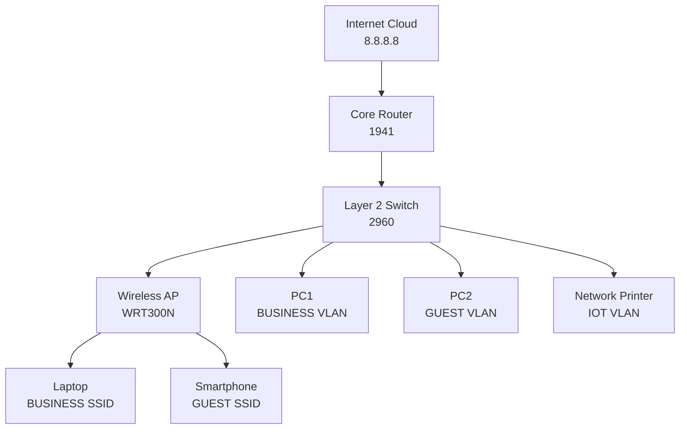
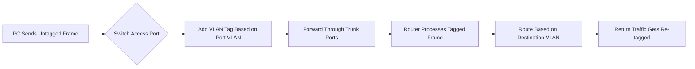

# **Project 01: SOHO Network - Secure Small Office Implementation**

**Status:** Tested ✅ | **Last Updated:** 2024-01-20

## **Table of Contents**
- [Objective](#objective)
- [Quick Start](#quick-start)
- [Topology & Design](#topology--design)
- [Configuration](#configuration)
- [Verification](#verification)
- [Troubleshooting](#troubleshooting)
- [Protocol Deep Dive](#protocol-deep-dive)
- [Skills Demonstrated](#skills-demonstrated)
- [Real-World Applications](#real-world-applications)
- [Learning Outcomes](#learning-outcomes)

## **Objective**
> Implement a secure, segmented small office network that separates business operations from guest access while maintaining internet connectivity for all users.

**Key Goals:**
- [ ] Create VLAN segmentation for business and guest traffic
- [ ] Configure router-on-a-stick for inter-VLAN routing
- [ ] Implement basic port security on switch ports
- [ ] Set up multi-SSID wireless with VLAN separation
- [ ] Establish proper security policies using ACLs

## **Quick Start**
### **Prerequisites**
- Basic Cisco CLI navigation skills
- Understanding of IP addressing and subnets
- Packet Tracer installed and ready

### **Implementation Checklist**
- [ ] Build topology and cable devices
- [ ] Configure router VLAN interfaces and DHCP
- [ ] Configure switch VLANs and port assignments
- [ ] Configure wireless access point
- [ ] Implement security features
- [ ] Verification and testing

### **Session Breakdown**
| Session | Focus | Key Activities |
|---------|-------|----------------|
| Foundation | Core Setup | Topology building, VLAN creation, basic device configurations |
| Implementation | Feature Deployment | Router subinterfaces, DHCP, wireless SSIDs, security policies |
| Validation | Testing & Verification | Connectivity tests, VLAN isolation verification, security validation |
| Polish | Documentation | Final testing, configuration backup, documentation cleanup |

## **Topology & Design**



### **Network Design Table**
| Component | Specification | Purpose |
|-----------|---------------|---------|
| BUSINESS VLAN | 192.168.10.0/28 | Workstations & trusted devices |
| GUEST VLAN | 192.168.20.0/28 | Visitor internet access |
| IOT VLAN | 192.168.30.0/28 | Printers & smart devices |
| NATIVE VLAN | 192.168.99.0/28 | Switch management |

### **The WHY**
- **Why router-on-a-stick?** Cost-effective for small offices - single router interface handles multiple VLANs without expensive layer 3 switches
- **Why /28 subnets?** Perfect for SOHO scale (14 hosts per VLAN), prevents IP address waste while allowing room for growth
- **Why separate IOT VLAN?** Isolates potentially vulnerable smart devices from business data, following security best practices

## **Configuration**

### **Core Router Configuration**
```bash
! Configure VLAN subinterfaces
interface GigabitEthernet0/0
 no shutdown
!
interface GigabitEthernet0/0.10
 description BUSINESS_VLAN
 encapsulation dot1Q 10
 ip address 192.168.10.1 255.255.255.240
 ip access-group BUSINESS-IN in
!
interface GigabitEthernet0/0.20
 description GUEST_VLAN  
 encapsulation dot1Q 20
 ip address 192.168.20.1 255.255.255.240
 ip access-group GUEST-STRICT in

! DHCP Configuration
ip dhcp pool BUSINESS_POOL
 network 192.168.10.0 255.255.255.240
 default-router 192.168.10.1
 dns-server 8.8.8.8 8.8.4.4

ip dhcp pool GUEST_POOL
 network 192.168.20.0 255.255.255.240
 default-router 192.168.20.1
 dns-server 8.8.8.8 8.8.4.4

! Reserve first IPs for static devices
ip dhcp excluded-address 192.168.10.1 192.168.10.5
ip dhcp excluded-address 192.168.20.1 192.168.20.5
```

### **Switch Configuration**
```bash
! Create VLANs
vlan 10
 name BUSINESS
vlan 20  
 name GUEST
vlan 30
 name IOT
vlan 99
 name NATIVE

! Trunk to Router
interface GigabitEthernet0/1
 description TRUNK_TO_ROUTER
 switchport mode trunk
 switchport trunk native vlan 99
 switchport trunk allowed vlan 10,20,30,99

! Business Ports
interface GigabitEthernet0/2
 description BUSINESS_PC1
 switchport mode access
 switchport access vlan 10
 switchport port-security
 switchport port-security maximum 2
 spanning-tree portfast

! Guest Port  
interface GigabitEthernet0/3
 description GUEST_PORT
 switchport mode access
 switchport access vlan 20
 switchport port-security
 switchport port-security maximum 1

! IOT Port
interface GigabitEthernet0/4
 description NETWORK_PRINTER
 switchport mode access
 switchport access vlan 30

! Trunk to Wireless AP
interface GigabitEthernet0/5
 description TO_WIRELESS_AP
 switchport mode trunk
 switchport trunk native vlan 99
 switchport trunk allowed vlan 10,20,99
```

### **Wireless Access Point Configuration**
```bash
! Business SSID
dot11 ssid BUSINESS-SECURE
 vlan 10
 authentication open
 authentication key-management wpa2
 wpa-psk ascii SOHOsecure123!

! Guest SSID  
dot11 ssid GUEST-ACCESS
 vlan 20
 authentication open
 guest-mode
 max-associations 8

! Apply SSIDs to radio
interface Dot11Radio0
 ssid BUSINESS-SECURE
 ssid GUEST-ACCESS
!
interface Dot11Radio1
 ssid BUSINESS-SECURE  
 ssid GUEST-ACCESS
```

### **Security ACLs**
```bash
! Business VLAN ACL
ip access-list extended BUSINESS-IN
 permit ip 192.168.10.0 0.0.0.15 any
 remark "Business users need full internet access"
 deny ip any any log

! Guest VLAN ACL - Internet Only
ip access-list extended GUEST-STRICT  
 deny ip 192.168.20.0 0.0.0.15 192.168.0.0 0.0.255.255
 remark "Guests cannot access internal networks"
 permit ip 192.168.20.0 0.0.0.15 any
 deny ip any any log
```

### **The WHY**
- **Why port-security maximum 2?** Allows for a desktop and occasional laptop connection without being too restrictive, balancing security and usability
- **Why spanning-tree portfast?** Prevents 30-second delay on access ports when devices connect, improving user experience
- **Why explicit 'deny ip any any log'?** Logs any unexpected traffic for security monitoring and troubleshooting

## **Verification**

### **Expected Results**
```bash
# Verify VLANs are active
SW1# show vlan brief

VLAN Name                             Status    Ports
---- -------------------------------- --------- -------------------------------
1    default                          active    Gi0/6, Gi0/7, Gi0/8, Gi0/9
10   BUSINESS                         active    Gi0/2, Gi0/5
20   GUEST                            active    Gi0/3, Gi0/5
30   IOT                              active    Gi0/4
99   NATIVE                           active    Gi0/1, Gi0/5
```

### **Verification Steps**
1. **Step 1:** `show vlan brief` - Verify VLAN assignments and port memberships
2. **Step 2:** `show port-security` - Check security status and violation counts
3. **Step 3:** `ping 8.8.8.8` from BUSINESS PC - Test internet access
4. **Step 4:** `ping 192.168.10.1` from GUEST PC - Should FAIL (ACL blocking)
5. **Step 5:** Connect to wireless SSIDs - Verify correct VLAN assignment and connectivity

### **The WHY**
- **Why verify VLAN assignments first?** Foundation of segmentation - if VLANs are wrong, nothing else works properly
- **Why test both success and failure cases?** Ensures security policies work in both directions and confirms proper isolation
- **Why check port security?** Confirms physical security measures are active and provides baseline for monitoring

## **Troubleshooting**

### **Common Issues & Solutions**
| Symptom | Possible Cause | Solution |
|---------|---------------|----------|
| No DHCP address | VLAN mismatch on port | Check `show vlan` and port assignments |
| Can't ping internet | ACL blocking traffic | Verify ACL rules with `show access-lists` |
| Wireless not connecting | SSID VLAN misconfiguration | Check AP configuration `show dot11 associations` |
| Port security violation | Too many devices connected | Check `show port-security` and adjust maximum |
| Inter-VLAN ping working | Missing ACL on subinterface | Apply correct access-group to subinterface |

### **Debug Commands**
```bash
# Troubleshooting commands
show ip interface brief              # Check interface status
show running-config                  # Verify current configuration
show port-security interface [int]   # Check specific port security
show dot11 associations              # View wireless clients
show access-lists                    # Verify ACL rules and hits
debug ip packet                     # See packet flow (use carefully)
```

## **Protocol Deep Dive**

### **VLAN Operation**


### **Key Concepts**
- **802.1Q Tagging:** Adds 4-byte VLAN tag to Ethernet frames for identification across trunk links
- **Native VLAN:** Carries untagged traffic on trunk ports, should be secured and separate from user VLANs
- **Router-on-a-stick:** Single physical interface with multiple logical subinterfaces, each handling a different VLAN
- **Port Security:** Learns MAC addresses dynamically and prevents unauthorized device connections

### **Packet Analysis**
> In real networks, use Wireshark to observe 802.1Q tagged frames between switch and router, and monitor DHCP discovery/offer process across VLAN boundaries

## **Skills Demonstrated**
- ✅ **VLAN Configuration** - Creating and managing virtual LANs for logical segmentation
- ✅ **Router-on-a-stick** - Inter-VLAN routing implementation on budget hardware
- ✅ **Port Security** - Physical network access control and MAC address management
- ✅ **Wireless Segmentation** - Multi-SSID deployment with proper VLAN mapping
- ✅ **Basic ACLs** - Traffic filtering between network segments
- ✅ **DHCP Management** - IP address assignment and scope management per segment

## **Real-World Applications**

### **Small Business Use Cases**
- **Home Office:** Consultant with client visitors needing secure guest WiFi separate from business systems
- **Retail Shop:** Separate point-of-sale systems from customer WiFi to meet PCI compliance
- **Medical Office:** Isolate patient WiFi from medical records network for HIPAA compliance
- **Legal Practice:** Secure segmentation between client-facing systems and case management databases

### **Business Value**
- **Security:** Prevents guest devices from accessing business data and internal resources
- **Cost Savings:** Single router handles multiple networks instead of requiring expensive layer 3 switches
- **Compliance:** Meets basic security requirements for data separation in regulated industries
- **Scalability:** Easy to add more VLANs as business grows or departments expand
- **User Experience:** Provides appropriate access levels for different user types without complexity

## **Learning Outcomes**
By completing this lab, you will understand:

### **Technical Knowledge**
- How VLANs logically separate broadcast domains and improve network performance
- Router subinterface configuration and operation for inter-VLAN routing
- Basic wireless security principles and segmentation strategies
- Network access control principles and implementation methods

### **Practical Skills**
- Designing appropriate network segmentation for different business requirements
- Implementing and testing security policies for various user types
- Troubleshooting layer 2 and layer 3 connectivity issues in segmented networks
- Documenting network configurations for maintenance and troubleshooting

---

**Maintained by:** Sai Aik Kwan | **[Rick's Home Lab](https://github.com/rick-homelab)**  
*Found an issue? [Open a GitHub Issue](https://github.com/rick-homelab/business-network-simulations/issues)*

*"Building networks that solve real business challenges with appropriate technical solutions."*
