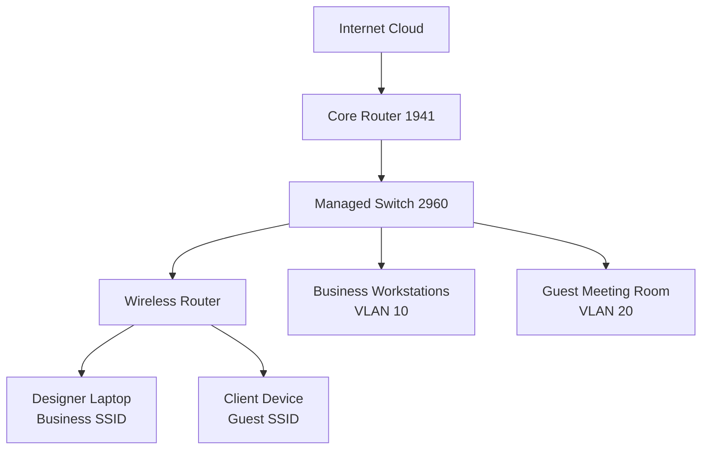

# 🔐 SOHO Network Security Implementation

**Business Impact:** Protected client data for growing web design studio  
**Technical Solution:** Multi-VLAN segmentation with guest isolation  
**Status:** ✅ Tested & Production-Ready | **Platform:** Cisco Packet Tracer

## 🎯 Quick Validation
```bash
# Copy-paste to verify implementation:
show vlan brief
ping 8.8.8.8 from business    # Should SUCCEED
ping 192.168.10.1 from guest  # Should FAIL (security working)
show port-security
show access-lists
```

## 📸 Proof of Implementation

*Guest devices completely isolated from business network - security policies actively blocking unauthorized access*

  
*Multi-VLAN architecture properly configured with business (VLAN 10) and guest (VLAN 20) segmentation*

## 🛠️ Technical Architecture


## 💼 Business Value Delivered
- **Client Data Protection:** Isolated guest network prevents access to business systems and cloud credentials
- **Cost Optimization:** Enterprise security features on SOHO budget using router-on-a-stick
- **Professional Environment:** Secure client meetings with reliable connectivity and isolated guest access
- **Growth Ready:** Scalable architecture supporting business expansion from 6 to 10+ employees

## 🎓 Skills Demonstrated
- **Network Security:** VLAN segmentation, ACLs, port security, wireless isolation
- **Business Analysis:** Requirements translation from business needs to technical solutions  
- **Cisco Technologies:** Router-on-a-stick, multi-SSID wireless, IOS configuration
- **Solution Validation:** Comprehensive testing methodology and documentation
- **Cost-Effective Design:** Appropriate technology selection for business scale

## 📁 Project Assets
- `soho-network.pkt` - **Working Lab File** (Ready to demo)
- `DETAILED-IMPLEMENTATION.md` - **Full Technical Documentation**

---
**🔍 Deep Dive Available:** [View Detailed Implementation Guide](./DETAILED-IMPLEMENTATION.md)  
**🚀 Hands-On Demo:** [Download Working Lab File](./soho-network.pkt)

---
**Maintained by:** Sai Aik Kwan | **[Rick's Home Lab](https://github.com/username)**  

*"Building networks that solve real business challenges with appropriate technical solutions."*
